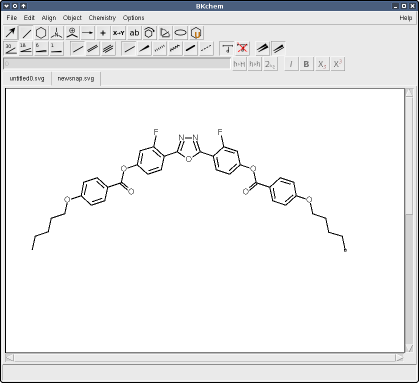
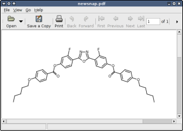

# BKChem and OASA

BKChem is a GUI for drawing chemical structures. OASA (Open Architecture for
Sketching Atoms and Molecules) is the chemistry library that powers structure
conversion and analysis. This repository is the primary home for both projects.

## Packages
- `packages/bkchem/` BKChem Tk GUI for drawing chemical structures.
- `packages/oasa/` OASA (Open Architecture for Sketching Atoms and Molecules)
  library and CLI converters used by BKChem.

## BKChem
BKChem is the user-facing drawing application. It uses OASA as the backend for
structure parsing, conversion, and analysis.

Use BKChem when you need:
- A GUI for drawing and editing structures by hand.
- Template-based sketching, fragment reuse, and layout helpers.
- Visual export workflows backed by OASA conversions.

## OASA
OASA is the chemistry library and conversion engine. It can be used on its own
in scripts or services, and it powers BKChem under the hood.

Use OASA when you need:
- Programmatic access to structure graphs and conversions.
- Batch processing and automation outside the GUI.
- A reusable backend for other chemistry tools.

## Highlights
BKChem
- Interactive chemical drawing with templates and reusable fragments.
- Batch mode scripting for automation and scripted edits.
- Export and import workflows powered by OASA.

OASA
- Python library for chemical structure graphs and conversions.
- Used by BKChem but available as a standalone library.

## Screenshots (legacy)
The screenshots below are from the archived site (Python 2 era) but still show
core workflows that BKChem supports today.

## Docs
- [docs/INSTALL.md](docs/INSTALL.md) for running from source and optional installs.
- [docs/CODE_ARCHITECTURE.md](docs/CODE_ARCHITECTURE.md) and
  [docs/FILE_STRUCTURE.md](docs/FILE_STRUCTURE.md) for repo layout details.
- [docs/MIGRATION.md](docs/MIGRATION.md) for the repository merge summary.
- [docs/USER_GUIDE.md](docs/USER_GUIDE.md) for the migrated BKChem manual.
- [docs/BATCH_MODE.md](docs/BATCH_MODE.md) and
  [docs/EXTERNAL_IMPORT.md](docs/EXTERNAL_IMPORT.md) for scripting and batch use.
- [docs/CUSTOM_PLUGINS.md](docs/CUSTOM_PLUGINS.md) and
  [docs/CUSTOM_TEMPLATES.md](docs/CUSTOM_TEMPLATES.md) for extension workflows.
- [docs/RELEASE_DISTRIBUTION.md](docs/RELEASE_DISTRIBUTION.md) for release plans.
- [packages/oasa/README.md](packages/oasa/README.md) for OASA-specific usage.
- [packages/bkchem/README.md](packages/bkchem/README.md) for BKChem-specific usage.

## Distribution
- Planned: publish OASA to PyPI from this repository.
- Planned: ship BKChem binary installers (macOS dmg, Linux Flatpak, Windows).

## Local website mirror
- `bkchem_webpage/` contains a local copy of the legacy BKChem website.

## Project home
- [GitHub repository](https://github.com/vosslab/bkchem) is the primary homepage.

## Legacy references
- [Legacy BKChem site](https://bkchem.zirael.org/) (Python 2 era, not maintained).
- [Legacy OASA site](https://bkchem.zirael.org/oasa_en.html) (Python 2 era, not maintained).

## License
- See `LICENSE` and `packages/oasa/LICENSE`.
